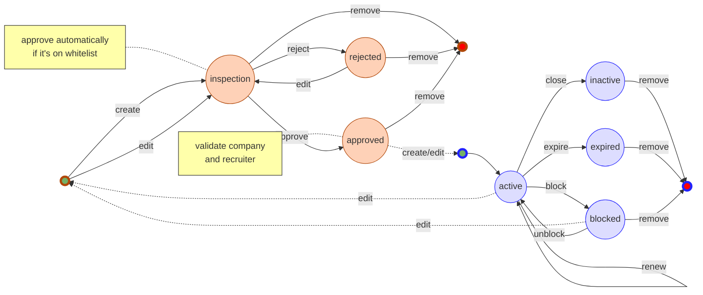

# test

#d

# JobAd Documentation

JobAd main purpose is to manage JobAd lifecycle.

## Development

The development stack can be built with `docker-compose`. Just create a `local.env` file (see `local.env.sample`) and run:
```bash
docker-compose up
```

Then you will be able to make API calls on port 8080 like so:
```
curl -v -X GET "http://localhost:8080/health"
```


And you will be able to read API documentation on port 8082 from browser: [http://localhost:8082/](http://localhost:8082/).

All commands on this project are made using `GNU make`, to know available actions on make, use `make` or `make usage`:


```bash
make

make usage
```

### Dependencies

#### Go

To build and run unit tests on this project `golang 1.11+` is needed, if you dont have it installed you can use the command below to call `make`

```bash
docker run --rm -i -v "$(pwd)":/go/src/github.com/catho/ja-jobad/ -w /go/src/github.com/catho/ja-jobad golang:latest sh -c "make [actions...]"
```

eg.

```bash
docker run --rm -i -v "$(pwd)":/go/src/github.com/catho/ja-jobad/ -w /go/src/github.com/catho/ja-jobad golang:latest sh -c "make build"
```

#### AWSCli

If you are using OSX, use it on a [virtualenv](https://packaging.python.org/guides/installing-using-pip-and-virtualenv/)

```bash
virtualenv -p python3.6 .venv
. ./.venv/bin/activate
```

```bash
pip install awscli
pip install awscli-local
aws configure
#for localstack you can use info below:
#$ AWS Access Key ID: dummy
#$ AWS Secret Access Key: dummy
#$ Default region name: us-east-1

```

#### Localstack

- start localstack

```bash
docker run --name="localstack" -p 8081:8081 -p 4567-4583:4567-4583 -e SERVICES=dynamodb,dynamodbstreams,lambda,kinesis -e DATA_DIR=/tmp/localstack/data -e PORT_WEB_UI=8081 -e DOCKER_HOST=unix:///var/run/docker.sock -v $(pwd)/tmp/localstack:/tmp/localstack localstack/localstack
```

- create tables

```bash
awslocal dynamodb create-table --table-name jobads --attribute-definitions AttributeName=id,AttributeType=S AttributeName=companyID,AttributeType=S --key-schema AttributeName=companyID,KeyType=HASH AttributeName=id,KeyType=RANGE --provisioned-throughput ReadCapacityUnits=400,WriteCapacityUnits=50

awslocal dynamodb create-table --table-name jobad_events --attribute-definitions AttributeName=event,AttributeType=S --key-schema AttributeName=event,KeyType=HASH --provisioned-throughput ReadCapacityUnits=50,WriteCapacityUnits=50 --stream-specification StreamEnabled=true,StreamViewType=KEYS_ONLY
```

### Build

Compiles, run unit tests and generate app binaries on directory `bin`

```bash
make build
```

output:

```bash
bin
└── linux_amd64
    ├── jobad-events
    └── jobad-webserver

```

### Tests

#### Unit

Unit tests are done with native [GO language tests](https://golang.org/pkg/testing/) and they are scattered with source code with same name of file to be tested, but a `_test` suffix.

To run unit tests:
```bash
make test
```

#### Integration

Integration tests are done with [PyRestTest](https://github.com/svanoort/pyresttest) and they are at `./integration-tests` folder.

To run integration tests:
```bash
make integration-test
```

To create a new scenario, create a file at `./integration-tests` with a filename with the pattern `test-*.yaml` (see PyRestTest YAML specification).

Some scenarios require that specific resources must be absent or present.

You can specify resources to delete on `integration-tests/fixtures.sh`.

And you can specify resources to create on `integration-tests/fixtures/*.json` (they will be created/overwritted on DynamoDB on test bootstrap).

## Execution

### Run APP

```bash
make run-webserver
```

Or run in development mode (it restarts the webserver when .go files changes)

```bash
make run-dev-webserver
```

To config environment variables on run, set them on `local.env`. If `local.env` do not exists, `make` will create it using `local.env.sample` as base.

### Environment Variables

list all variables available

```bash
make args=-env run-webserver
```

## JobAd lifecycle


<details><summary>mermaid code...</summary>
<p>



</p>
</details>

## API

Links:

 * [Global information](https://github.com/catho/ja-jobad/blob/master/docs/v1/index.md)
 * [Job Ad](https://github.com/catho/ja-jobad/blob/master/docs/v1/jobad.md)

Check the folder `docs` the Postman collection [ja-jobad.postman_collection.json](https://github.com/catho/ja-jobad/blob/master/docs/v1/postman/ja-jobad.postman_collection.json)
